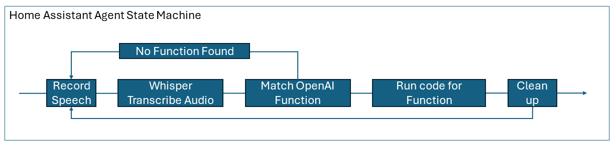

import Social from '@site/src/components/social';

<Social
    page_url="https://github.com/gloveboxes/azure-openai-service-proxy"
    image_url="https://gloveboxes.github.io/OpenAI-Whisper-Transcriber-Sample/assets/images/whispering-wide-66e027604c6c49af3c4a05b6144b2f40.jpeg"
    title="Azure OpenAI Proxy Service"
    description= "🏭 Get started with Azure OpenAI Proxy Service - Azure OpenAI Hacks Made Easy"
    hashtags="OpenAI"
    hashtag=""
/>

# Introduction to the OpenAI Proxy

This sample demonstrates how you can build a simple home assistant with [OpenAI Whisper](https://openai.com/research/whisper) and [OpenAI Functions](https://platform.openai.com/docs/guides/gpt/function-calling). 

OpenAI Whisper is a powerful multilingual speech-to-text transcriber, and OpenAI Functions allow you to extract structured data from unstructured text. Together, these AI models bridge the messy unstructured world of natural language, both speech and written, with the structured world of software development. This bridge opens up exciting possibilities for UX designers and App developers enabling more accessible and intuitive app experiences.

<!-- <iframe width="100%" height="420" src="https://www.youtube.com/embed/Io8cHdhRnYA" title="YouTube video player" frameborder="0" allow="accelerometer; autoplay; clipboard-write; encrypted-media; gyroscope; picture-in-picture; web-share" allowfullscreen></iframe> -->

## What is OpenAI Whisper?

The OpenAI Whisper model is an Open Source speech-to-text transcription model that is trained on 680,000 hours of multilingual and multitask supervised data collected from the web. The whisper model is available as a cloud [Speech to text API](https://platform.openai.com/docs/guides/speech-to-text) from OpenAI or you can run the Whisper model locally. This sample demonstrates how to run the Whisper model locally with the [openai-whisper](https://pypi.org/project/openai-whisper/) library to transcribe audio files.

<!-- OpenAI describes Whisper as an [encoder-decoder transformer](https://kikaben.com/transformers-encoder-decoder/), a type of neural network that can use context gleaned from input data to learn associations that can then be translated into the model's output. Quote from the [OpenAI Whisper](https://openai.com/research/whisper) webpage:

> We’ve trained and are open-sourcing a neural net called Whisper that approaches human level robustness and accuracy on English speech recognition. Whisper is an automatic speech recognition (ASR) system trained on 680,000 hours of multilingual and multitask supervised data collected from the web. We show that the use of such a large and diverse dataset leads to improved robustness to accents, background noise and technical language. Moreover, it enables transcription in multiple languages, as well as translation from those languages into English. We are open-sourcing models and inference code to serve as a foundation for building useful applications and for further research on robust speech processing. -->

## What are OpenAI Functions

OpenAI Function enables you to describe functions to [gpt-3.5-turbo-0613](https://platform.openai.com/docs/models/gpt-3-5) and [gpt-4-0613](https://platform.openai.com/docs/models/gpt-4) models and later, and have the GPT model intelligently select which function (if any) best matches the data in the prompt. The function definitions along with the prompt are passed to the OpenAI Chat Completion API. The GPT model then determines which function best matches the prompt and populates a JSON object using the function JSON schema and prompt data. If there is a successful match, the chat completion API returns the function name and the JSON object/entity.

## Home Assistant Orchestration

The home assistant is a simple orchestration of OpenAI Whisper and OpenAI Functions using a state machine. The home assistant can turn on and off imaginary lights, get weather conditions to `ground` OpenAI prompts, and more. It's an example of how you can use natural language with OpenAI Whisper and OpenAI Functions to build a home assistant that you can extend.

The agent flow is:

1. Record speech
2. Transcribe speech to text with OpenAI Whisper
3. Call OpenAI Chat Completion API with the transcribed text and function definitions to extract a function name and arguments.
4. Run code for the function and pass arguments.
5. Clean up
6. Rinse and repeat

## Running the Samples

There are two samples:

1. [Home Assistant](Assistant) - A simple home assistant that can turn on and off lights, and set the temperature.
2. [Transcribe with Whisper](Whisper-Client/Whisper-Client-Setup) - A sample that demonstrates how to transcribe audio files with the Whisper model.

<!--  ## Running OpenAI Whisper Sample

The Whisper model runs best on an NVidia GPU from WSL2 or Linux. The sample code will run on a CPU, both Intel and Apple Silicon are supported, but transcription will be slower. If you are running the model on a CPU then it's recommended to use smaller Whisper models for the transcriptions.

## Solution Architecture

The solution is divided into two parts:

1. A Whisper service, that wraps the [openai-whisper](https://pypi.org/project/openai-whisper/) library and loads the Whisper model, and exposes the model as a REST API.
2. A Whisper client, that calls the Whisper service to transcribe audio files. There are two clients:
    1. A GUI client that runs on Windows, macOS, and Linux.
    2. A Web client.

The advantage of this architecture is the model is loaded once by the Whisper service, a relatively time-consuming process, and then called multiple times by the Whisper clients.

 -->
