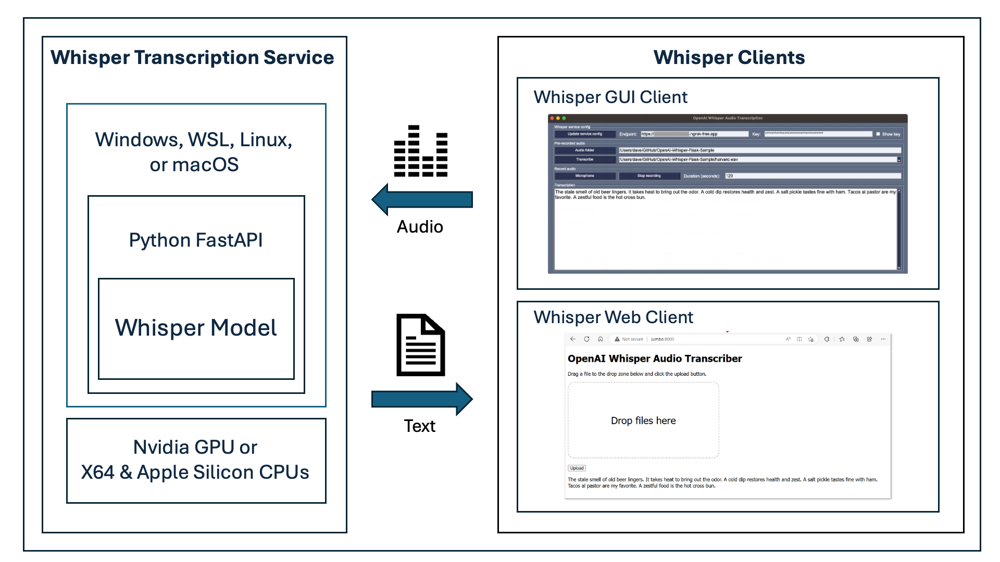

# Whisper server setup

The ideal and most performant configuration for running the OpenAI Whisper sample is with Windows with WSL 2 and an NVidia GPU or a Linux desktop system with an NVidia GPU.

You can also run the Whisper transcriber server on Windows, macOS, or Linux (tested on Ubuntu) systems [without an NVidia GPU](../Whisper-Server-no-GPU). The performance will be slower but more than acceptable when using smaller Whisper models.

