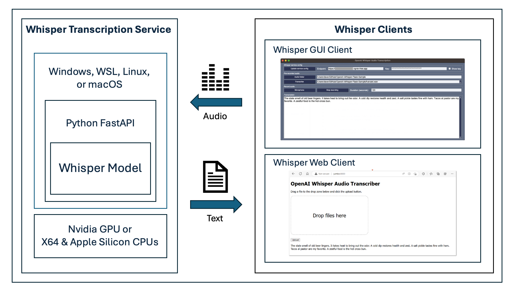

# Whisper Client Setup

This sample also includes a client app that can be used to interact with the Whisper Transcriber Service.  The client app can be used to: 

1. Transcribe audio files. The following file types are supported: avi ,mp3 ,mp4 ,mpeg ,mpga ,m4a ,wav ,webm.
2. Transcribe audio from a microphone.

The following document describes the ways to interact with the OpenAI Whisper Transcriber Service.

1. The Whisper Transcriber Client app is the most capable.
2. The Whisper Transcriber Web Client is the most convenient.
3. Securely access the Whisper Transcriber Service from anywhere with ngrok.
4. And using Postman to call the Whisper Transcriber Service REST API is useful for testing.

The following section describes how to install the Whisper Transcriber Client app on the same computer as the Whisper Transcriber Service.

