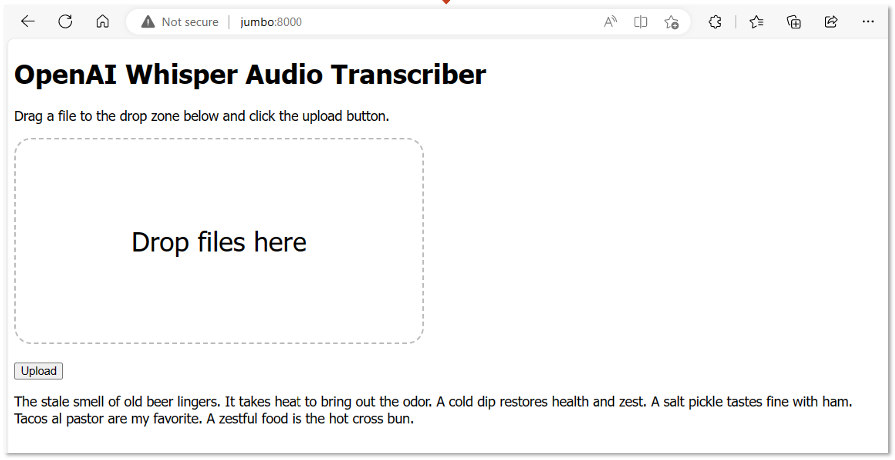

# The Whisper Web App

On the same computer as the Whisper Transcriber Service, you can run the Whisper Transcriber web app. The web app is a simple web page that allows you to select an audio file and transcribe it using the Whisper Transcriber Service.



## Install the Web App

You can install the Whisper Transcriber web app on Windows, macOS, and Linux. 

> Note, on Windows, install the Whisper web app on Windows, not in WSL.

## Install system dependencies

Follow the instructions for your operating system.

### Install Windows 11 dependencies

1. Install the latest version of [Python 3](https://www.python.org/downloads/).

### Install Ubuntu dependencies

1. Install `pip3`.
   1. Open a terminal window.
   2. Run `sudo apt install python3-pip`

## Install the required Python libraries

1. From a `Terminal` window, clone the Whisper Transcriber Sample to your preferred repo folder.
    ```bash
    git clone https://github.com/gloveboxes/OpenAI-Whisper-Transcriber-Sample.git
    ```
2. Navigate to the `client` folder.
   ```bash
   cd OpenAI-Whisper-Transcriber-Sample/client
   ```
3. Install the required libraries.

   On windows:

   ```powershell
   pip install requests
   ```

   On macOS and Linux:

   ```bash
   pip3 install requests
   ```

## Start the Web App

1. Run the following command to start the Whisper Transcriber web app.

   On Windows:

   ```powershell
   python whisper_web.py
   ```

   On macOS and Linux:

   ```bash
   python3 whisper_web.py
   ```

2. Open a web browser and navigate to `http://localhost:8000/`, or from a different computer, navigate to `http://<HOST ADDRESS>:8000/`

   

3. Drag and drop an audio file onto the web page and click `Upload`.

