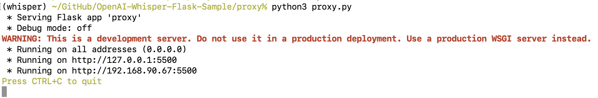

# Whisper Intranet Access

If you are running the Whisper Server in WSL and want to run the Whisper GUI app from a different computer on the same LAN, then run the `proxy.py` app on the same machine as the Whisper Transcriber Service. This is because the Whisper Transcriber Service REST API is not accessible from outside the Windows WSL environment. The `proxy` app runs on Windows and will forward the REST API calls to the Whisper Transcriber Service running in WSL.

The advantage of the `proxy` app compared to the `ngrok` is that the `proxy` app connection between the client and server will be a lot faster as traffic is not routed through the internet.

## Install the Proxy App

1. On the Windows machine that is running the Whisper Transcriber Service, install the latest version of [Python](https://www.python.org/downloads/) on Windows. At the time of writing, version 3.11.3.
1. Install the [git client](https://git-scm.com/downloads) if it's not already installed.
1. From a command prompt, clone the Whisper Transcriber Service Sample repository to your preferred repo folder.
   ```bash
   git clone https://github.com/gloveboxes/OpenAI-Whisper-Transcriber-Sample.git
   ```
1. Navigate to the `proxy` folder.
   ```bash
   cd OpenAI-Whisper-Transcriber-Sample/proxy
   ```
1. Install the required libraries.
   ```bash
   pip install requests
   ```
1. Start the proxy app.
   ```bash
   python proxy.py
   ```
   The app will start, showing the IP addresses that app is using.

   

   The proxy app is now listening for REST API calls on port `5600` and will forward them to the Whisper Transcriber Service running in WSL.

   In the Whisper GUI app, update the `Whisper server address` to the IP address of the Windows machine running the proxy app. For example `http://whisper:5600`.
   