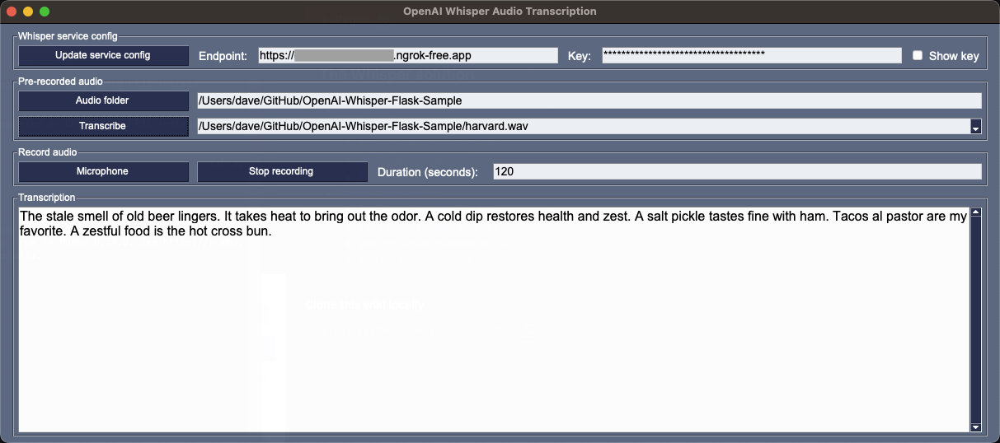

# Whisper Anywhere Access

If you want to access the Whisper Server running in WSL or Desktop Linux from a different computer or over the internet then you can use [ngrok](https://ngrok.com/).

## Install ngrok

1. Follow the instructions to install [ngrok](https://ngrok.com/download) for your operating system.
2. From a terminal window, navigate to the folder containing the `ngrok` executable.
3. Connect your ngrok account by running `ngrok config add-authtoken <token>` where `<token>` is your ngrok authentication token.
4. Run the following command to start the `ngrok` proxy app.

    ```bash
    ./ngrok http 5500
    ```

   The app will start, showing the IP addresses that app is using.

   

   Ngrok is now listening for REST API calls and will forward them to the Whisper Transcriber Service running in WSL listening on port 5500.

5. Update the `Whisper server address` in the Whisper GUI app to the `Forwarding` address shown in the `ngrok` app.

   

   