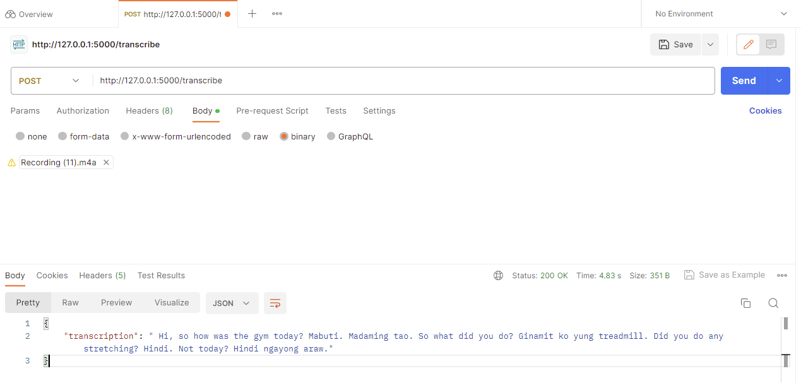

# Testing with Postman

The easiest way to test the Whisper Transcriber Service is with [Postman](https://www.postman.com/).

Start Postman and create a new HTTP request.

1. Create a new HTTP request
2. Select `POST`
3. Enter the endpoint of your flask server. Eg, `http://<HOST ADDRESS>:5500/transcribe`
4. Select `Body`, then select `binary`
5. Select the audio file you wish to transcribe
6. Select `Send`



The audio file will be transcribed and when complete, will return a JSON document with the transcription. Here's an example of a transcription that was a mix of English questions with Tagalog replies.

```json
{
    "transcription": " Hi, so how was the gym today? Mabuti. Madaming tao. So what did you do? Ginamit ko yung treadmill. Did you do any stretching? Hindi. Not today? Hindi ngayong araw."
}
```
