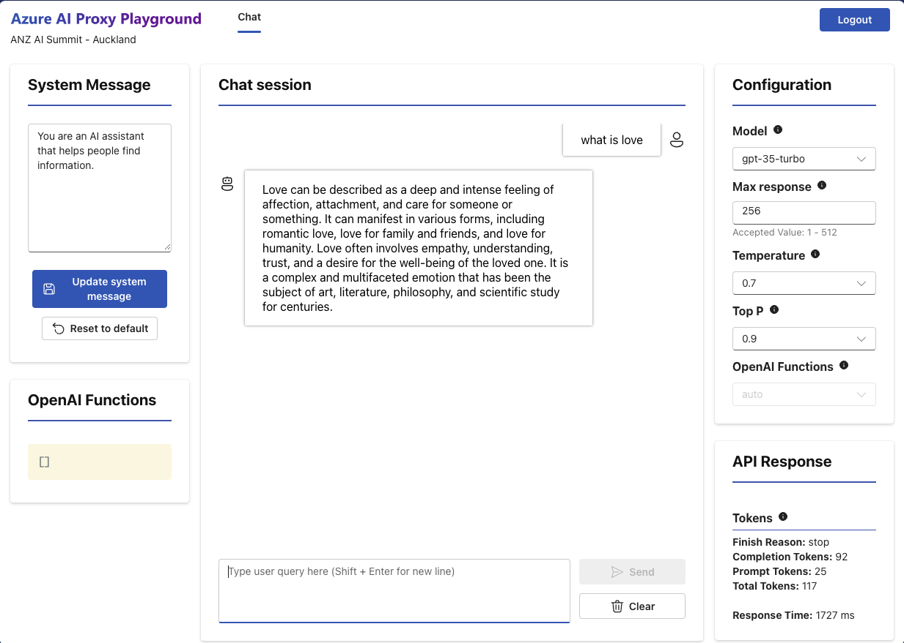

# Using the Playground

The Playground is a web-based application that allows you to test your OpenAI models. The Playground is a single page application (SPA) that is hosted in Azure Storage Static Websites. The Playground is a React application that uses the [Azure Static Web Apps](https://docs.microsoft.com/azure/static-web-apps/overview) framework.

## Authentication

An event attendee needs to authenticate to the Playground using an event code. The event code is validated and the current time is checked against the event start and end times. If the event code is valid and the event is active, then the attendee is allowed to use the Playground.

The Azure OpenAI proxy service provides a `Playground like` experience for developers to explore the Azure OpenAI chat completion using the time bound event code.

<!-- :::tip

The event start time and end time are in UTC (Universal Coordinated Time).

::: -->

