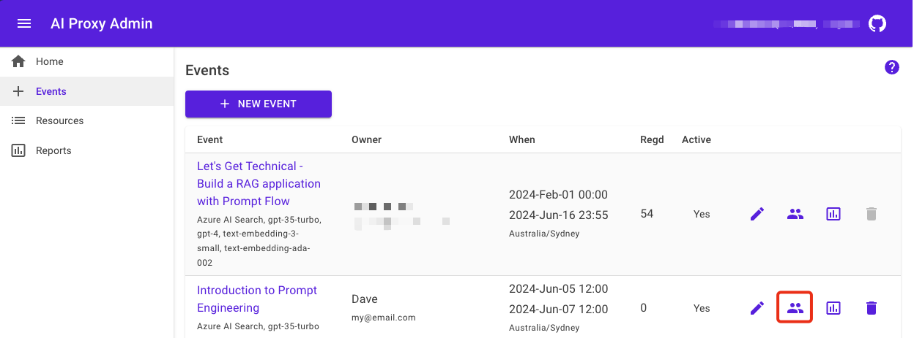
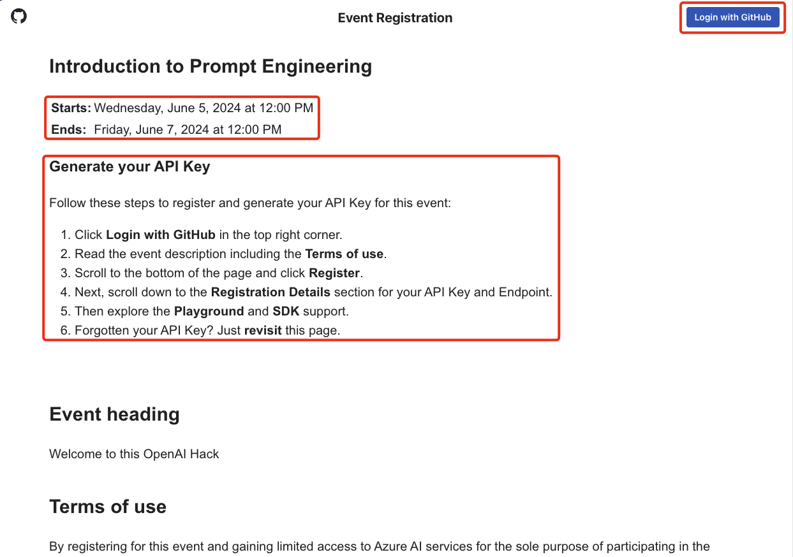
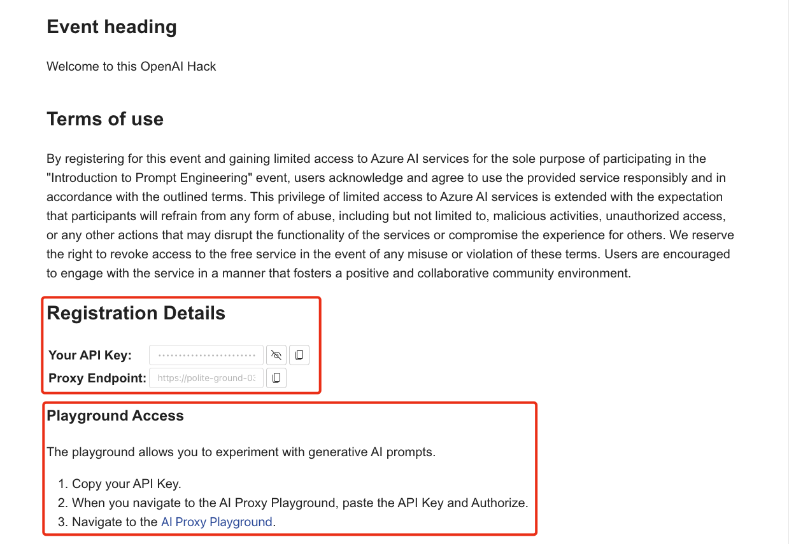

# Attendee registration

Once you have created an event and assigned resources to the event, you can share the event URL with the attendees. The attendees can register for the event and receive a time bound API Key to access the AI Proxy service.

Attendees are required to have a GitHub account to register for an event. The GitHub account is used to authenticate the attendee and provide access to the AI Proxy service.

1. Select the `Events` tab, then select the event you want to share with the attendees.

    

1. From the event details page, select the highlighted in red `Attendee/People` icon. The event registration page will open. Share the link to this page with your audience. The following image is an example of the event registration page.

    

1. The attendee authenticates with the AI Proxy service using their GitHub account.
1. Next, the attendee is presented with the event details and the `Register` button.
1. The attendee selects the `Register` button to register for the event to receive a time bound API Key to access the AI Proxy service.

## Event registration

The event registration page displays the event details and the `Register` button. The attendee selects the `Register` button to register for the event. The attendee is then presented with the `API Key` and Endpoint that is valid for the duration of the event.

