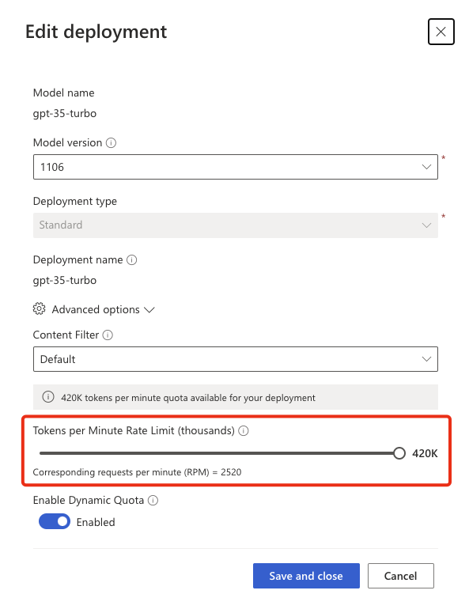
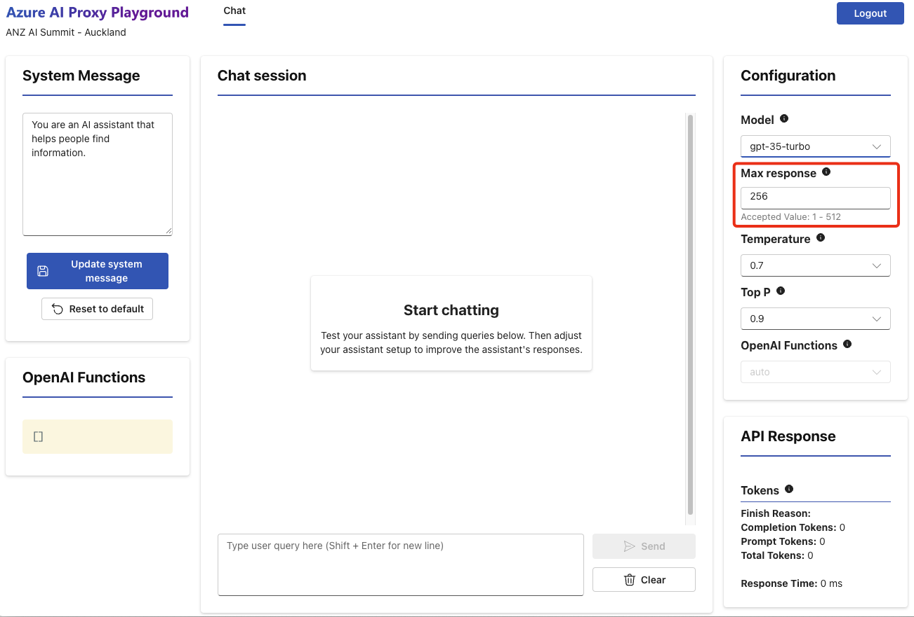

# Capacity planning

This is particularly important when running a workshop with many concurrent attendees. This is less important for long running hacks where model requests are spread over a longer period and therefore unlikely to exceed the model deployment per minute limits.

When running a workshop, you need to ensure that you have enough capacity from the model(s) underpinning the workshop.

There are two model deployment limits you need to be aware of:

- Tokens per Minute Rate Limit.
- Number of requests per minute.

## What happens if limits are exceeded

The model will start rate limiting requests and it will not accept new prompts for approx. 20 seconds. This will affect everyone in the workshop as they are sharing the same model, and it will not be a great user experience.

## How to calculate required deployment capacity

These calculations are based on the following assumptions:

- 100 attendees at a workshop.
- Attendees are generating 4 prompts per minute.
- Each prompt requires 200 tokens to successfully complete.

Calculate the needed Tokens per minute using the following formula:

**Required Tokens per Minute = Number of Attendees * Number of Prompts per Minute * Number of Tokens per Prompt**

This calculation is very generous, as it's unlikely attendees would collectively be generating that number of requests every minute for the whole workshop, but it's better to overestimate than underestimate.

For this example, a model deployment would need at least:

1. `Tokens per Minute Rate Limit` of 80K TPM.
1. `Number of requests per minute` of 400.

## What is the Max Token Cap parameter

When you create an event, you will set the `Max Token Cap` parameter. The Max Token Cap limits the tokens per request to a realistic number required for the prompt to complete successfully. This limit stops people requesting more tokens than required for the prompt to complete, as needed or not, the requested number of tokens is what is used to calculate the TPM for a model deployment. Note, billing is based on the actual tokens consumed.

What would happen if there was no Max Token cap? If 20 attendees decided to set the Max response to 4000 in the Playground, that would be 80000 TPM, multiply by 4 prompts per minute = 240000 TPM, you’ll quickly run out of capacity impacting everyone in the workshop.

So, the Max Token Cap limits the Max response size for a request in the AI Proxy Playground and SDKs for developers. In the following example, the **Max Token Cap** is 512, Playground defaults to half the **Max Token Cap**.

## Scaling capacity

There are two ways to scale model capacity:

1. Ask the Azure AI team in increase the TPM limit for a deployment.
1. Combine capacity from multiple subscriptions. The proxy will load balance across model deployments with the **same name** from multiple subscriptions. Then add the additional deployments to the event. When creating deployments in the proxy, set the deployment **Friendly Name** to identify the deployment/subscription, but ensure the **Deployment Name** is the same. See the [Configuring resources](./resources.md) guide for more information.

## Rule of thumb

- For a 1 hour workshop with 100 attendees, you might set the `Max Token Cap` to 512 and a `Daily Request Cap` of 256. But ensure you have enough capacity from the model(s) underpinning the workshop.
- For a multi-hour or multi-day hack, you might set the `Max Token Cap` to 4000 and a `Daily Request Cap` of 5000. Capacity planning is less critical for longer running hacks as the requests are spread over a longer period.
