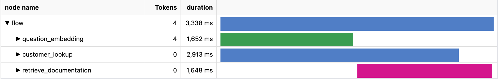

# Demo notes

## Slides

The PowerPoint slides with speaker notes are available for download

1. [English](https://view.officeapps.live.com/op/view.aspx?src=https%3A%2F%2Fraw.githubusercontent.com%2Fgloveboxes%2Fprompt_flow_demo_docs%2Fmain%2Fdocs%2Fresources%2FBuild%2520your%2520RAG%2520Application%2520with%2520Prompt%2520flow%2520in%2520Azure%2520AI%2520Studio%2520-%2520dglover.pptx)
1. [Japanese](https://view.officeapps.live.com/op/view.aspx?src=https%3A%2F%2Fraw.githubusercontent.com%2Fgloveboxes%2Fprompt_flow_demo_docs%2Fmain%2Fdocs%2Fresources%2FBRK408JP_jp-BRK408AU_Build your RAG Application with Prompt flow in Azure AI Studio - dglover.pptx)

## Actions

1. Deploy the Azure Resources.
1. Open Azure portal Webpage on Cosmos DB, Azure AI Search Azure AI Studio.
1. Deploy the Prompt Flow endpoint in ai.azure.com.

## High level

1. Discuss Azure AI Platform
1. Discuss RAG Pattern
1. Discuss Prompt Flow

## AI Studio

AI Studio is a generative AI development hub that provides access to thousands of language models from OpenAI, Meta, Hugging Face, and more.

## Prompt Flow

Azure Prompt Flow simplifies the process of prototyping, experimenting, and deploying AI applications powered by Large Language Models (LLMs).

## Step 1: Provisioning Azure resources

1. Review the Azure resources created by the Bicep template.

## Step 2A: Create your first Prompt Flow

1. Load grounding data and review in the Azure portal.
1. Create your first Prompt Flow
    - Set question to `what tents can you recommend for beginners?`.
    - Set connection to `aoai-connection`.
    - Run the flow

## Step 2B: Add a new tool

1. Select <kbd>ctrl or cmd + n</kbd> to create a new tool.
1. Select the **embedding** tool.
1. Set the **connection** to `aoai-connection`.
1. Set the **deployment_name** to `text-embedding-ada-002`.
1. Connect the **embedding** tool to the **question** input.
1. Run the flow.

## Step 3: Load grounding data

1. Review loaded data in Cosmos DB and Azure AI Search.

## Step 4: Retrieve, the R in RAG

1. **Update** the YAML from below.
1. **Debug** the **customer_lookup** tool.
1. Review the **Prompt Flow Execution Graph**

    

### Retrieve flow.dag.yaml

``` { .yaml .copy }
$schema: https://azuremlschemas.azureedge.net/promptflow/latest/Flow.schema.json
environment:
  python_requirements_txt: requirements.txt
inputs:
  chat_history:
    type: list
    is_chat_history: true
    default: []
  question:
    type: string
    is_chat_input: true
    default: recommended tents for beginners
  customer_id:
    type: string
    default: "7"
outputs:
  order_history:
    type: string
    reference: ${customer_lookup.output}
    is_chat_output: true
  Product_info:
    type: string
    reference: ${retrieve_documentation.output}
nodes:
- name: question_embedding
  type: python
  source:
    type: package
    tool: promptflow.tools.embedding.embedding
  inputs:
    connection: aoai-connection
    deployment_name: text-embedding-ada-002
    input: ${inputs.question}
- name: retrieve_documentation
  type: python
  source:
    type: code
    path: ../contoso-chat/retrieve_documentation.py
  inputs:
    question: ${inputs.question}
    index_name: contoso-products
    embedding: ${question_embedding.output}
    search: contoso-search
- name: customer_lookup
  type: python
  source:
    type: code
    path: ../contoso-chat/customer_lookup.py
  inputs:
    customerId: ${inputs.customer_id}
    conn: contoso-cosmos

```

## Step 5: Augmentation, the A in RAG

### Prompt templating

Prompt Flow uses [Jinja2](https://pypi.org/project/Jinja2/) a templating language for Python, to format prompts.

1. **Update** the YAML from below.
1. To see templating in action, select the link on the **customer_prompt** tool.

### Augmentation flow.dag.yaml

``` { .yaml .copy }
$schema: https://azuremlschemas.azureedge.net/promptflow/latest/Flow.schema.json
environment:
  python_requirements_txt: requirements.txt
inputs:
  chat_history:
    type: list
    is_chat_history: true
    default: []
  question:
    type: string
    is_chat_input: true
    default: recommended tents for beginners
  customer_id:
    type: string
    default: "7"
outputs:
  answer:
    type: string
    reference: ${inputs.question}
    is_chat_output: true
  context:
    type: string
    reference: ${customer_prompt.output}
nodes:
- name: question_embedding
  type: python
  source:
    type: package
    tool: promptflow.tools.embedding.embedding
  inputs:
    connection: aoai-connection
    deployment_name: text-embedding-ada-002
    input: ${inputs.question}
- name: retrieve_documentation
  type: python
  source:
    type: code
    path: ../contoso-chat/retrieve_documentation.py
  inputs:
    question: ${inputs.question}
    index_name: contoso-products
    embedding: ${question_embedding.output}
    search: contoso-search
- name: customer_lookup
  type: python
  source:
    type: code
    path: ../contoso-chat/customer_lookup.py
  inputs:
    customerId: ${inputs.customer_id}
    conn: contoso-cosmos
- name: customer_prompt
  type: prompt
  source:
    type: code
    path: ../contoso-chat/customer_prompt.jinja2
  inputs:
    documentation: ${retrieve_documentation.output}
    customer: ${customer_lookup.output}
    history: ${inputs.chat_history}
```

## Step 6: Generation, the G in RAG

1. Run all the flow.
1. Review the outputs in a new tab.
1. Review the prompt tokens and duration tab

### Generation flow.dag.yaml

``` { .yaml .copy }
$schema: https://azuremlschemas.azureedge.net/promptflow/latest/Flow.schema.json
environment:
  python_requirements_txt: requirements.txt
inputs:
  chat_history:
    type: list
    is_chat_history: true
    default: []
  question:
    type: string
    is_chat_input: true
    default: recommended tents for beginners
  customer_id:
    type: string
    default: "7"
outputs:
  answer:
    type: string
    reference: ${llm_response.output}
    is_chat_output: true
  context:
    type: string
    reference: ${retrieve_documentation.output}
nodes:
- name: question_embedding
  type: python
  source:
    type: package
    tool: promptflow.tools.embedding.embedding
  inputs:
    connection: aoai-connection
    deployment_name: text-embedding-ada-002
    input: ${inputs.question}
- name: retrieve_documentation
  type: python
  source:
    type: code
    path: ../contoso-chat/retrieve_documentation.py
  inputs:
    question: ${inputs.question}
    index_name: contoso-products
    embedding: ${question_embedding.output}
    search: contoso-search
- name: customer_lookup
  type: python
  source:
    type: code
    path: ../contoso-chat/customer_lookup.py
  inputs:
    customerId: ${inputs.customer_id}
    conn: contoso-cosmos
- name: customer_prompt
  type: prompt
  source:
    type: code
    path: ../contoso-chat/customer_prompt.jinja2
  inputs:
    documentation: ${retrieve_documentation.output}
    customer: ${customer_lookup.output}
    history: ${inputs.chat_history}
- name: llm_response
  type: llm
  source:
    type: code
    path: ../contoso-chat/llm_response.jinja2
  inputs:
    deployment_name: gpt-35-turbo
    prompt_text: ${customer_prompt.output}
    question: ${inputs.question}
  connection: aoai-connection
  api: chat
```

## Step 7: Prompt evaluations

Run and discuss the Prompt evaluations. The evaluations uses GPT -4 to evaluate the performance of the gpt-35-turbo model. At the moment, gpt-4 atm, is slower and more expensive that gpt-35-turbo, but it makes a good evaluation model.

1. Open the **evaluate-chat-local.ipynb** from the **eval** folder.
1. Run the notebook.
1. Discuss calling two flows.
1. Discuss the results:
    1. The **flow.dag.yaml** flow in the **contoso-chat** folder.
    1. The **flow.dag.yaml** flow in the **groundedness** folder.

## Step 8: Testing and deployment

1. Run local
1. Discuss deployment options
1. Test the deployed endpoint

## Few shot example in the repo

For a great example of using few shot learning to understand customer intent, see the **contoso-intent** folder in the repo.
