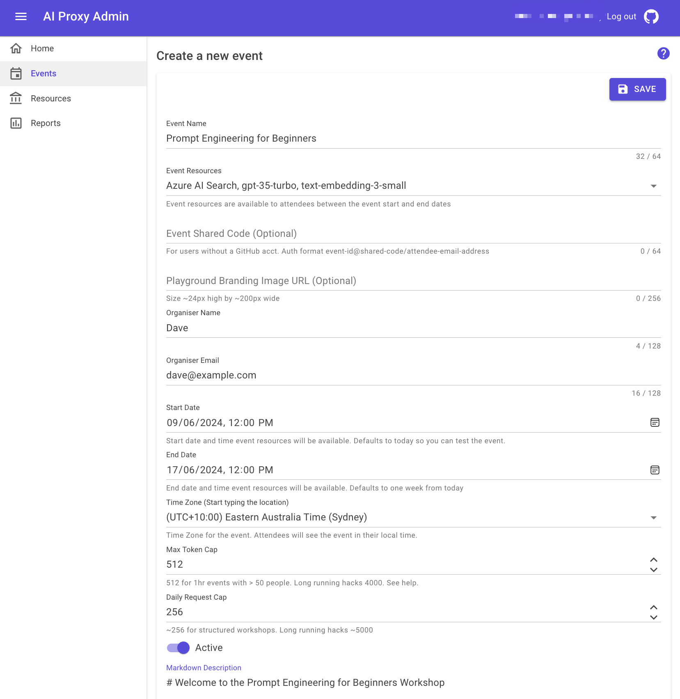

# Events

Once you have configured the resources, you can use the same resources for multiple events. This guide will walk you through the process of setting up events.

## Setting up events

From the AI Proxy Admin portal, you can create and manage events. An event is a time bound access to the AI Proxy service.

1. Sign into the AI Proxy Admin portal and authenticate using your organization's Entra credentials.
1. Select the `Events` tab, then add a new event.

      

1. Add the event details, including the event name, start and end date.

   1. **Event Name**: The name of the event.
   1. **Event Resources**: You can select multiple resources for an event. The resources are the model and indexes that you configured in [Resources](./resources.md).
   1. **Organizer Name**: The name of the event organizer.
   1. **Organizer Email**: The email of the event organizer.
   1. **Start Date**: The start date/time of the event. You can set the date/time using the date picker or by typing the date/time in the format `YYYY-MM-DDTHH:MM:SS`.
   1. **End Date**: The end date/time of the event. You can set the date/time using the date picker or by typing the date/time in the format `YYYY-MM-DDTHH:MM:SS`.
   1. **Max Token Cap**: The maximum number of tokens needed for a prompt to complete successfully. For a short 1 hour event, set the `Max Token Cap` to 512. For a longer multi day event, and depending on the models deployed, set the `Max Token Cap` to a larger number like 4000. See the [Capacity planning](./capacity.md) section for more information.
   1. **Daily Request Cap**: The maximum number of requests that can be made by a user to the Azure OpenAI resources per day. The goal of the Daily Request Cap is to prevent runaway usage and abuse of the model.  The `Daily Request Cap` resets at midnight UTC.
   1. **Description**: The `Markdown` description of the event. This description is displayed when an event attendee registers for a time bound API Key to access the AI Proxy service.
   1. Select `Save` to create the event.
   1. **Event Shared Code**: In most cases, you can leave this field blank.

      - The `Event Shared Code` is used where attendees may not have a GitHub account or for various reasons are unable to authenticate using their existing GitHub account. The shared code should only be used for **short** (eg 1hr) workshops at in-person events or online events, it's not recommended for longer running hacks.

      - The API KEY authentication format is `event-id@shared-code/email-address`. For example, if the Event Shared Code is `BUILD2024`, and the event-id is `1111-1111`, then the API Key for the event will be `1111-1111@BUILD2024/attendee@mail.com`.

      - The `event-id` is a unique identifier for and event, its generated by the system and can be found in the URL of the event `ATTENDEE` page.

      - Note, no PII is stored, the API KEY is one way hashed (sha256) and stored in the database for per user usage tracking.

   1. **Event Image URL**: In most cases, you can leave this field blank.

      - The URL of the event image used to provide some branding for the event on the AI Playground. The image should be rectangular, approximately 24 pixels high, and approximately 200 pixels wide. If the image bigger or smaller, it will be resized to fit the space in the top left hand side of the Playground.

      

!!! note
    Remember, if you are load balancing across multiple models, ensure the model deployments names are the same, and add each deployment to the event. For more information about load balancing, see the [Capacity planning](./capacity.md/#scaling-capacity) section.
