# Production LLM apps with Azure AI and Prompt Flow

## Slides

The PowerPoint slides with speaker notes are available for download

1. [English](https://view.officeapps.live.com/op/view.aspx?src=https%3A%2F%2Fraw.githubusercontent.com%2Fgloveboxes%2Fprompt_flow_demo_docs%2Fmain%2Fdocs%2Fresources%2FBuild%2520your%2520RAG%2520Application%2520with%2520Prompt%2520flow%2520in%2520Azure%2520AI%2520Studio%2520-%2520dglover.pptx)
1. [Japanese](https://view.officeapps.live.com/op/view.aspx?src=https%3A%2F%2Fraw.githubusercontent.com%2Fgloveboxes%2Fprompt_flow_demo_docs%2Fmain%2Fdocs%2Fresources%2FBRK408JP_jp-BRK408AU_Build your RAG Application with Prompt flow in Azure AI Studio - dglover.pptx)

## Workshop introduction

This workshop is a Prompt Flow/RAG 101. An introduction to the key concepts of building a Retrieval Augmented Generation (RAG) Large Language Model (LLM) application with Azure AI, Prompt Flow, and VS Code.

There are two approaches to grounding your LLM apps with your data. You can either fine tune a model or use the RAG pattern.

1. Fine tuning a model is complex and expensive.
1. RAG - Retrieval Augmented Generation. RAG is an industry approach to enriching a prompt with context, it is cheaper, less complex than fine tuning a model, easier to leverage existing IT investments.

Grounding is the process of connecting your Large Language Model (LLM) to your data. It is a critical step to ensure that the model's responses are relevant and aligned with current knowledge. Grounding also helps prevent the model from generating misleading or inaccurate information.

## Rag pattern use cases

1. **Information Retrieval:** Enhancing search engines to provide more accurate and context-aware results.
1. **Conversational Agents:** Improving chatbots or virtual assistants for more natural and contextually relevant interactions.
1. **Content Generation:** Creating high-quality articles, summaries, or creative writing with improved coherence.
1. **Language Translation:** Enhancing language translation services for more nuanced and context-aware translations.
1. **Code Generation:** Assisting developers in generating code snippets or completing code with better contextual understanding.
1. **Customer Support:** Improving automated responses in customer service applications for more effective and empathetic communication.
1. **Education:** Facilitating personalized learning experiences by providing tailored explanations and resources based on user queries.

## Introduction to AI Studio

AI Studio is a generative AI development hub that provides access to thousands of language models from OpenAI, Meta, Hugging Face, and more.

1. It offers data grounding with retrieval augmented generation (RAG), prompt engineering and evaluation, built-in safety, and continuous monitoring for language models.
1. With Azure AI Studio, you can quickly and securely ground models on your structured, unstructured, and real-time data.
1. It is a powerful tool for professional software developers who want to create generative AI applications.

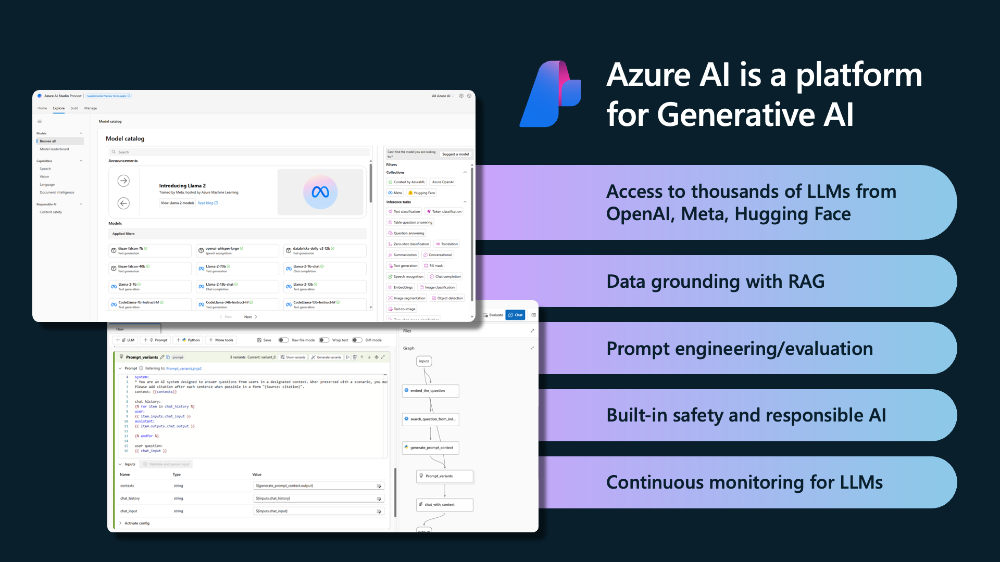

### What is Prompt Flow

Azure Prompt Flow simplifies the process of prototyping, experimenting, and deploying AI applications powered by Large Language Models (LLMs). It is designed for developers, data scientists, researchers, or hobbyists who want to create LLM-based applications. With Azure Prompt Flow, you can create and compare multiple prompt variants, evaluate their performance, and debug your flows with ease.

### VS Code code first support

There is now a [Prompt Flow extension for VS Code](https://marketplace.visualstudio.com/items?itemName=prompt-flow.prompt-flow) to build your LLM apps, this extension makes it easy to use version control systems like `git` as well as collaborating with others.

<!-- ### Why streamlining LLM Ops with Prompt Flow

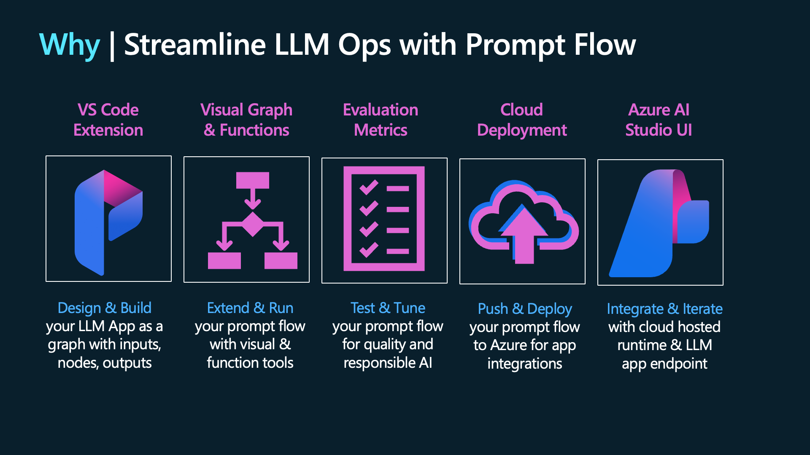 -->

### Prompt Flow and LangChain

A question you might be asking is what is the difference between Prompt Flow and LangChain. Prompt Flow is an end-to-end solution for prototyping, evaluation, deployment to production, and monitoring. LangChain is a library that you could use in your Prompt Flows.

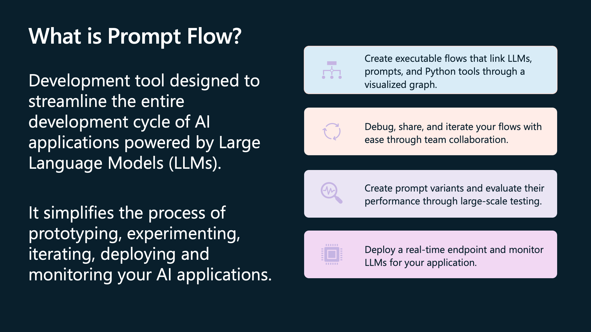

### The LLM Lifecycle

The LLM lifecycle is a complex and iterative process that involves ideation, development, deployment, and management. The process is unified by four overarching loops, with three primary loops: Ideation & Exploration, Building & Augmenting, and Operationalizing. Developers experiment with LLM prompts to understand how they engage with data, refine LLMs to align them with specific enterprise needs, and ensure LLMs are easily integrated into systems and operate safely. The Management loop focuses on governance, security, and compliance. Azure AI simplifies the complexities of the Enterprise LLM Lifecycle.

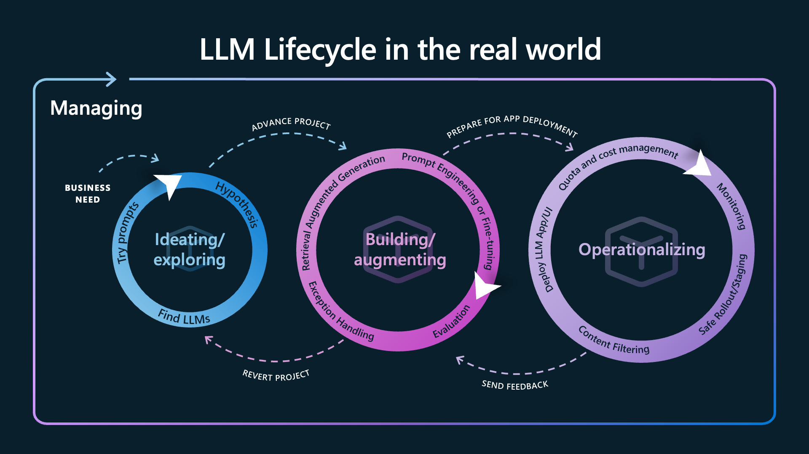

## Workshop - Overview

The focus of the workshop is on pillar 1 (Ideation/exploring) and touches upon pillar 2 (Building/augmenting).

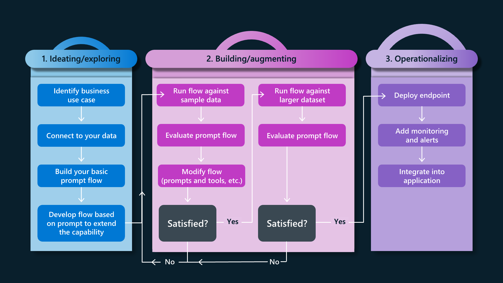

### Solution overview

The solution is a chatbot that helps customers find the right product for their needs. The chatbot is built with Prompt Flow and uses a RAG pattern to ground the LLM prompt with product information and customer order history. A user can ask a question like `what tents can you recommend for beginners?` and the chatbot will respond with a product recommendation based on the customer's order history and the product catalog.

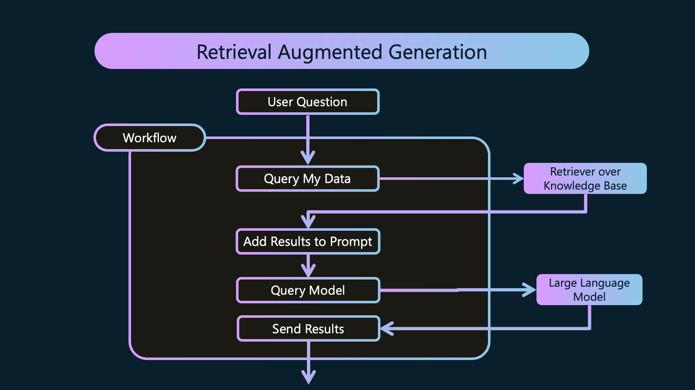

The Contoso outdoor eCommerce site calls the Prompt Flow chatbot to provide product recommendations to customers.

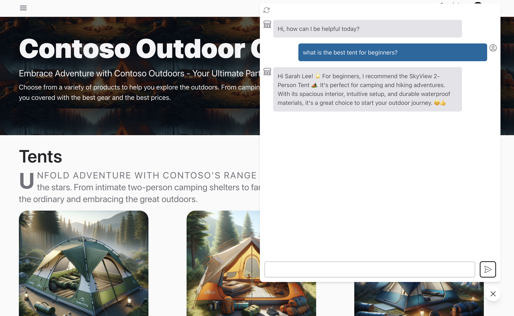

> You can deploy your own instance of the [Contoso Outdoors eCommerce site](https://github.com/Azure-Samples/contoso-web).

### Terms used

- [Generative pre-trained transformer (GPT)](https://en.wikipedia.org/wiki/Generative_pre-trained_transformer)
- [Large Language Model (LLM)](https://en.wikipedia.org/wiki/Large_language_model)
- [Retrieval Augmented Generation (RAG)](https://learn.microsoft.com/azure/search/retrieval-augmented-generation-overview)
- [Hybrid Azure AI Search](https://learn.microsoft.com/azure/search/hybrid-search-overview)
- [Prompt Flow](https://learn.microsoft.com/azure/machine-learning/prompt-flow/overview-what-is-prompt-flow?view=azureml-api-2)
- [Directed acyclic graph (DAG)](https://en.wikipedia.org/wiki/Directed_acyclic_graph)
- BYOD: Bring Your Own Data

### Requirements

You require an Azure Subscription. If you don't have an Azure subscriptions, you can create a [free subscription](https://azure.microsoft.com/en-us/free/free-account-faq).

## Step 1: Provisioning Azure resources

In this section you'll set up the Azure resources required for the workshop.

1. Clone the [contoso-chat](https://github.com/azure-Samples/contoso-chat) repo.
1. From the VS Code Dev Container or the virtual Python environment, run the `./provision.sh` script.
1. After the provisioning script completes, follow the instructions raised in this [issue](https://github.com/Azure-Samples/contoso-chat/issues/52).

## Step 2: Load grounding data

The solutions uses two data sources to ground the LLM prompt. The first is an Azure AI Search index that contains product information. The second is a Cosmos DB database that contains customer information.

### Load the product catalog

In this step you'll learn how to load product data into [Azure AI Search](https://learn.microsoft.com/en-us/azure/search/). The product database will be used to ground the LLM prompt with product information.

Azure AI Search is a hybrid index service with support for keyword and semantic vector search. When data the is loaded into Azure AI Search, a keyword index is built for each product, and an embedding is generated for each product and is stored in a vector index.

Architecturally, a search service sits between the external data stores that contain your un-indexed data, and your client app that sends query requests to a search index and handles the response.


Follow these steps:

1. Ensure you have the **contoso-chat** repo open in VS Code.
1. Load the Product catalog
    - Open the `data/product_info/products.csv` file and review the contents.
    - Run the `data/product_info/create-azure-search.ipynb` Jupyter Notebook. The notebook will store product data and generated product description embeddings in Azure AI Search.
    - Switch to Azure AI Search in the Azure Portal
    - Review the AI Search resource and note that the semantic search feature is enabled.
    - Show the indexes:
        - Select the `contoso-products` index. There are 20 documents indexed.
        - Search the index - `what tents can you recommend?`. Azure AI Search will use the keyword index to return the product catalog results that most closely match the question.
        - Review the results and note the vector from the embedding is returned with each result.
        - The Prompt Flow will use the index to ground the LLM prompt.

            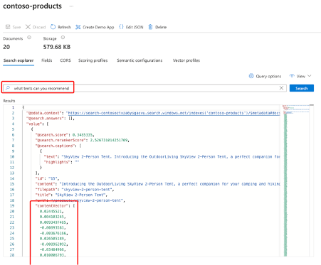

### Load the customer database

In this step you'll learn how to load customer data into [Cosmos DB](https://docs.microsoft.com/azure/cosmos-db/introduction). The customer data will be used to ground the LLM prompt with customer order history.

1. Run the `/data/customer_info/create-cosmos-db.ipynb` Jupyter Notebook to load the customer data into Cosmos DB.
1. Navigate to Cosmos DB in Azure Portal and update one of the records with your name.
    - Select Data Explorer -> contoso-outdoor -> Customers -> Items.
    - Pick and item to update, the select Update.

        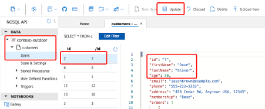

### Create connections

In this step you'll learn how to create connections to Azure AI Services, Azure AI Search, and Cosmos DB.

1. Ensure you have the **contoso-chat** repo open in VS Code.
1. Run the `data/create-connections.ipynb` Jupyter Notebook.

## Step 3: Create your first Prompt Flow

In this section you'll learn the basics of Prompt Flow with VS Code.

1. Select the Prompt Flow VS Code extension and review the following tabs: **QUICK ACCESS, FLOWS, TOOLS, BATCH RUN HISTORY, and CONNECTIONS**. Note, the connections were created in the previous section.

    

1. Create a new Prompt Flow:
    - Create a new folder in the contoso-chat folder called **intro_chat**.
    - Right-click the **intro_chat** folder and select **New flow in this directory**.

        Review the generated `flow.dag.yaml` file.

1. Select the **Visual Editor** link at the top of the `flow.dag.yaml` file to open the visual editor.

    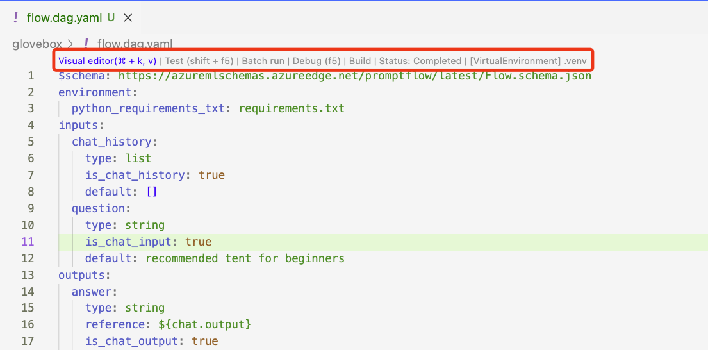

1. Adjust the layout of the visual editor to suit your preferences.

    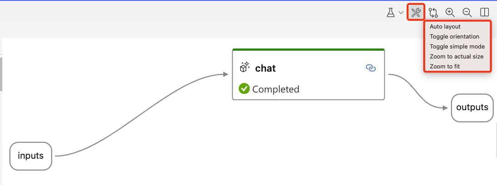

1. Set the Prompt Flow parameters:
    - Set the **inputs** question to `what tents can you recommend for beginners?`.
    - Select the **Chat** tool and set the **connection** to `aoai-connection`.
    - **Workaround**, if you forget to set these parameters, the flow may not execute using the **Run All** button. Set the missing parameters and run the flow with the **Debug** option <kbd>F5</kbd>.

1. Run the flow by selecting **Run All** or <kbd>shift+F5</kbd>.

    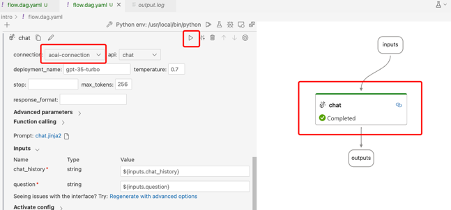

1. Select **Run it with Standard Mode**.

1. Review Prompt Flow tab to show tokens used and run duration

    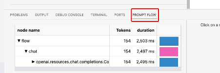

1. Select the **outputs** tool, then select **"Output in new tab"**.

    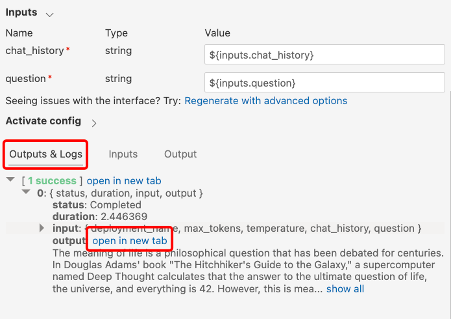

1. Switch back to the `flow.dag.yaml` file.

## Step 4: Retrieve, the R in RAG

In this step there will be two retrievals that will be used to ground the LLM prompt with product information and customer order history.

1. Query the product catalog Azure AI Search service for product information
1. Query the customer Cosmos DB database for customer order history information.

### Retrieving product information

To retrieve product information, we'll use the Azure AI Search index that was created in the previous section. First, we'll generate an embedding for the question and perform a keyword and semantic search on the product index in Azure AI Search.

#### Generate an embedding

To search a vector store like Azure AI Search, we first need to create an embedding for the question. We do this by passing the question text to an embeddings model, in this case, **text-embedding-ada-002**.

#### What is an embedding

An embedding is a type of vector that is generated by a machine learning model and has semantic meaning. In this workshop we'll be using the **text-embedding-ada-002** model which generates a 1 x 1536 dimensioned vector.

#### Querying the product index

Next, both the question and vector are passed to the AI Search engine. AI Search will use a combination of vector and keyword [hybrid search](https://learn.microsoft.com/azure/search/hybrid-search-overview) techniques to return the product catalog results that most closely match the question.

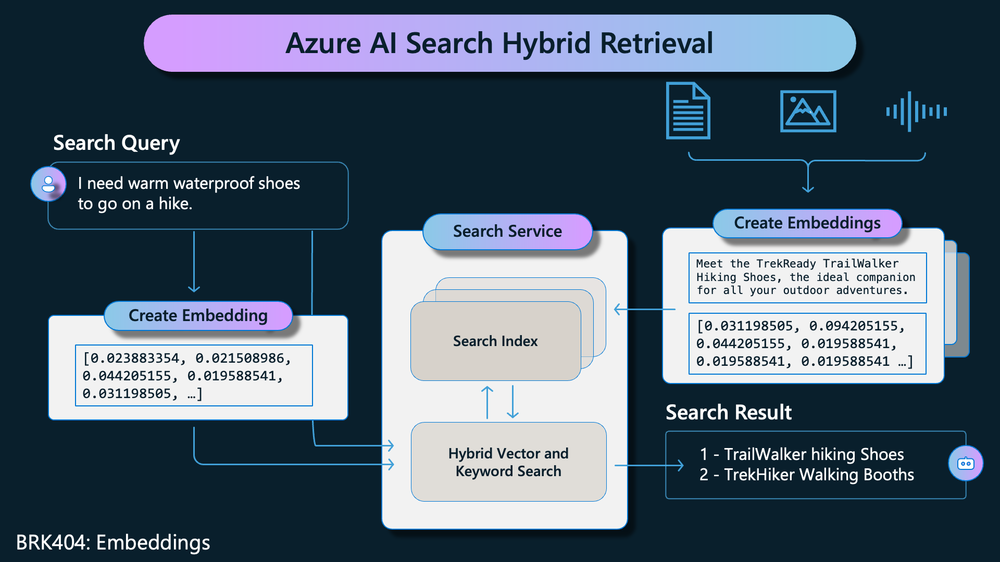

### Retrieving data

Follow these steps to retrieve the product and customer information:

1. **Close the Visual Editor tab to avoid issues with the next steps.**
1. From VS Code, navigate to the **intro_chat** folder and open the **flow.dag.yaml** file. The file contains the YAML representation of the Prompt Flow.
1. Replace the existing flow with the following YAML.

    ``` { .yaml .copy }
    $schema: https://azuremlschemas.azureedge.net/promptflow/latest/Flow.schema.json
    environment:
      python_requirements_txt: requirements.txt
    inputs:
      chat_history:
        type: list
        is_chat_history: true
        default: []
      question:
        type: string
        is_chat_input: true
        default: recommended tents for beginners
      customer_id:
        type: string
        default: "7"
    outputs:
      answer:
        type: string
        reference: ${customer_lookup.output}
        is_chat_output: true
      context:
        type: string
        reference: ${retrieve_documentation.output}
    nodes:
    - name: question_embedding
      type: python
      source:
        type: package
        tool: promptflow.tools.embedding.embedding
      inputs:
        connection: aoai-connection
        deployment_name: text-embedding-ada-002
        input: ${inputs.question}
    - name: retrieve_documentation
      type: python
      source:
        type: code
        path: ../contoso-chat/retrieve_documentation.py
      inputs:
        question: ${inputs.question}
        index_name: contoso-products
        embedding: ${question_embedding.output}
        search: contoso-search
    - name: customer_lookup
      type: python
      source:
        type: code
        path: ../contoso-chat/customer_lookup.py
      inputs:
        customerId: ${inputs.customer_id}
        conn: contoso-cosmos
    ```

### Custom tools

1. Select **Visual editor** from the top of the **flow.dag.yaml** file.

1. Review the **customer_lookup** custom tool, click the link to **open code file**.

    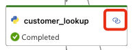

1. Review the code for the **customer_lookup** tool. The tool performs a query on the Cosmos DB database to retrieve customer information.

1. Set a breakpoint at line 9.

    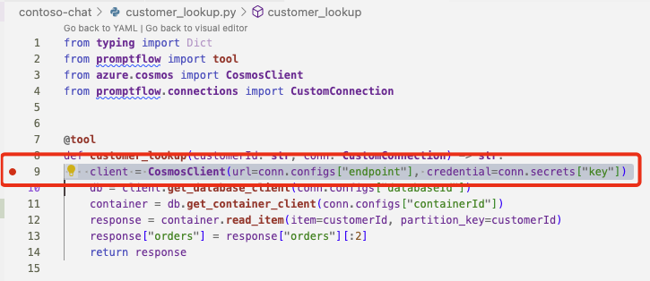

1. Select **Debug** the **retrieve_documentation** tool.
    - The prompt flow execution starts and stops at the breakpoint you set in the **retrieve_documentation** tool.
    - Step through the code or press <kbd>F5</kbd> to continue.
    - Remove the breakpoint and step through the code or press <kbd>F5</kbd> to continue.

    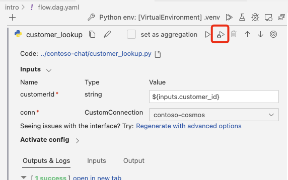

## Step 5: Augmentation, the A in RAG

In this step you'll learn how to augment the LLM prompt with product and customer information to create a prompt that is grounded with context.

1. **Close the Visual Editor tab to avoid issues with the next steps.**
1. From VS Code, navigate to the `intro_chat` folder and open the **flow.dag.yaml** file. The file contains the YAML representation of the Prompt Flow.
1. Replace the existing flow with the following YAML.

    ``` { .yaml .copy }
    $schema: https://azuremlschemas.azureedge.net/promptflow/latest/Flow.schema.json
    environment:
      python_requirements_txt: requirements.txt
    inputs:
      chat_history:
        type: list
        is_chat_history: true
        default: []
      question:
        type: string
        is_chat_input: true
        default: recommended tents for beginners
      customer_id:
        type: string
        default: "7"
    outputs:
      answer:
        type: string
        reference: ${inputs.question}
        is_chat_output: true
      context:
        type: string
        reference: ${customer_prompt.output}
    nodes:
    - name: question_embedding
      type: python
      source:
        type: package
        tool: promptflow.tools.embedding.embedding
      inputs:
        connection: aoai-connection
        deployment_name: text-embedding-ada-002
        input: ${inputs.question}
    - name: retrieve_documentation
      type: python
      source:
        type: code
        path: ../contoso-chat/retrieve_documentation.py
      inputs:
        question: ${inputs.question}
        index_name: contoso-products
        embedding: ${question_embedding.output}
        search: contoso-search
    - name: customer_lookup
      type: python
      source:
        type: code
        path: ../contoso-chat/customer_lookup.py
      inputs:
        customerId: ${inputs.customer_id}
        conn: contoso-cosmos
    - name: customer_prompt
      type: prompt
      source:
        type: code
        path: ../contoso-chat/customer_prompt.jinja2
      inputs:
        documentation: ${retrieve_documentation.output}
        customer: ${customer_lookup.output}
        history: ${inputs.chat_history}
    ```

### Prompt templating

Prompt Flow uses [Jinja2](https://pypi.org/project/Jinja2/) a templating language for Python, to format prompts.

1. To see templating in action, select the link on the **customer_prompt** tool.

    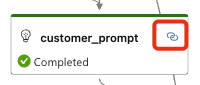

1. Review the template. The template combines the data from the product catalog and the customer database into a prompt with all the context needed for the LLM.

1. Review the sections on safety, documentation (the product info), previous orders (from the customer lookup), and chat history.

1. Switch back to the prompt flow visual editor.
1. Select the **customer_prompt** and start the prompt flow execution.

    <!-- 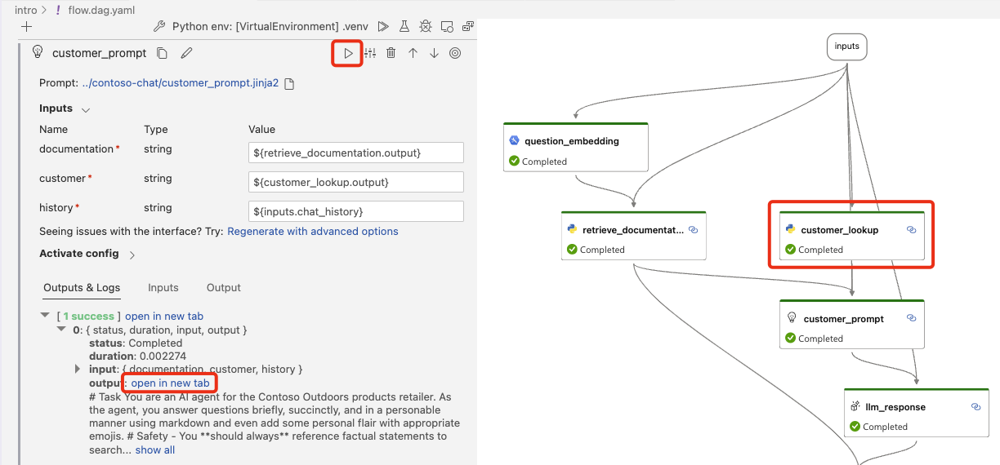 -->

1. When the execution has completed, select the **outputs** tool and **open in new tab** to review the output from the Jinja template.

## Step 6: Generation, the G in RAG

In this step you'll learn how to generate a response from the LLM.

1. **Close the Visual Editor tab to avoid issues with the next steps.**
1. From VS Code, navigate to the `intro_chat` folder and open the **flow.dag.yaml** file. The file contains the YAML representation of the Prompt Flow.
1. Replace the existing flow with the following YAML.

    ``` { .yaml .copy }
    $schema: https://azuremlschemas.azureedge.net/promptflow/latest/Flow.schema.json
    environment:
      python_requirements_txt: requirements.txt
    inputs:
      chat_history:
        type: list
        is_chat_history: true
        default: []
      question:
        type: string
        is_chat_input: true
        default: recommended tents for beginners
      customer_id:
        type: string
        default: "7"
    outputs:
      answer:
        type: string
        reference: ${llm_response.output}
        is_chat_output: true
      context:
        type: string
        reference: ${retrieve_documentation.output}
    nodes:
    - name: question_embedding
      type: python
      source:
        type: package
        tool: promptflow.tools.embedding.embedding
      inputs:
        connection: aoai-connection
        deployment_name: text-embedding-ada-002
        input: ${inputs.question}
    - name: retrieve_documentation
      type: python
      source:
        type: code
        path: ../contoso-chat/retrieve_documentation.py
      inputs:
        question: ${inputs.question}
        index_name: contoso-products
        embedding: ${question_embedding.output}
        search: contoso-search
    - name: customer_lookup
      type: python
      source:
        type: code
        path: ../contoso-chat/customer_lookup.py
      inputs:
        customerId: ${inputs.customer_id}
        conn: contoso-cosmos
    - name: customer_prompt
      type: prompt
      source:
        type: code
        path: ../contoso-chat/customer_prompt.jinja2
      inputs:
        documentation: ${retrieve_documentation.output}
        customer: ${customer_lookup.output}
        history: ${inputs.chat_history}
    - name: llm_response
      type: llm
      source:
        type: code
        path: ../contoso-chat/llm_response.jinja2
      inputs:
        deployment_name: gpt-35-turbo
        prompt_text: ${customer_prompt.output}
        question: ${inputs.question}
      connection: aoai-connection
      api: chat
    ```

### Calling the LLM

Next, the prompt that was generated in the previous step will be passed to the LLM.

1. Switch back to the prompt flow visual editor.
1. Select the **outputs** tool.
1. Press Shift+F5 or select **Run all** from the designer to run the complete Prompt Flow.
1. Review the **outputs** of the prompt flow execution by selecting the **outputs** tool, select **open in new tab**.
1. Review the Prompt Flow tab to show tokens used and run duration.

    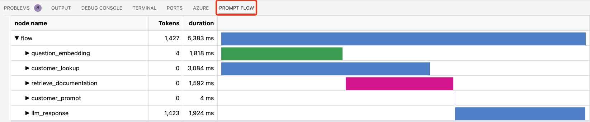

## Step 7: Prompt evaluations

In this step you'll learn how to evaluate the effectiveness of the chat. The evaluation is done by running the chat against the original contoso-chat prompt flow and using the GPT-4 model to evaluate the chat and score how well it performs. There are a number of use cases for evals, including CI/CD, A/B testing, and model selection.

1. You should run the `/eval/evaluate-chat-local.ipynb`` and review the use of gpt-4 to evaluate the effectiveness of the chat.
    - This notebook calls the `groundedness` Prompt Flow in the `eval` folder which calls GPT-4 to evaluate the context that was sent to the LLM and the response that was returned.
    - A groundedness metric is calculated and returned.
1. Note this demo runs against the original contoso-chat prompt flow, not the one we just built.

## Step 8: Testing and deployment

### Local testing

Before deploying the LLM app to Azure, it can be useful to run it locally for testing.

1. To run the LLM app locally, select run, then select **Build as a local app**.

    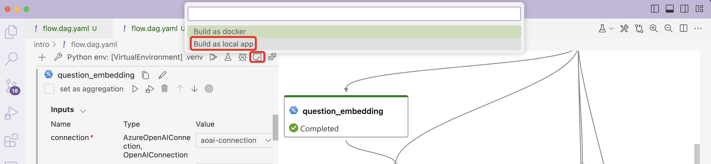

1. To start the app, select **start local app**.

    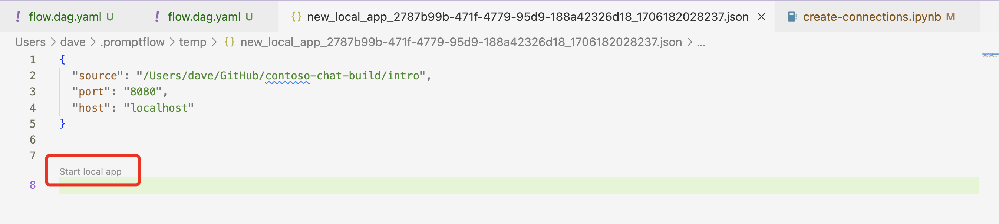

1. A browser page will open, and then you can interact with the LLM app.

1. To exit the app, from the VS Code terminal, press <kbd>ctrl+c</kbd>.

### Deployment to Azure

In this step you'll learn how to deploy the Prompt Flow to Azure.

1. From VS Code, navigate to the `deployment` folder and open the **push_and_deploy_pf.ipynb** Jupiter Notebook.
1. Run the notebook to deploy the Prompt Flow to Azure.

    

### Testing the deployed app

1. After the deployment has completed, navigate to the Azure AI Portal (ai.azure.com).
1. Select **Build**.
1. Select the deployed Prompt Flow.
1. Select the **Deployments** tab
1. Select the deployed app endpoint.
1. Select **Test**.
1. Ask a question `what tents can you recommend for beginners?`.
