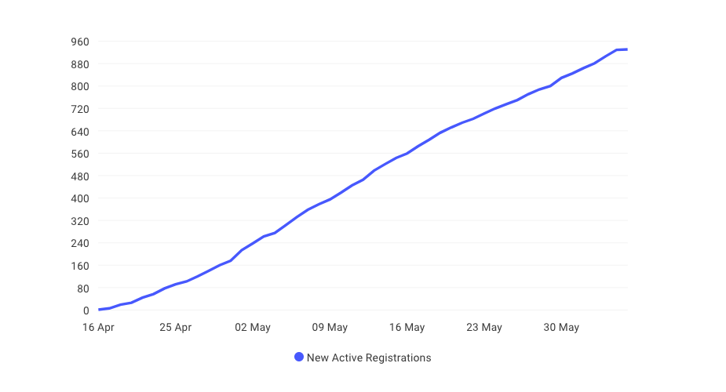
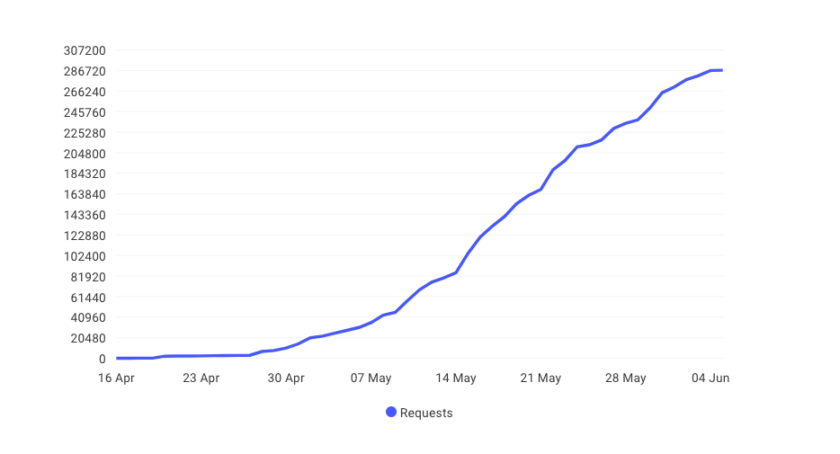
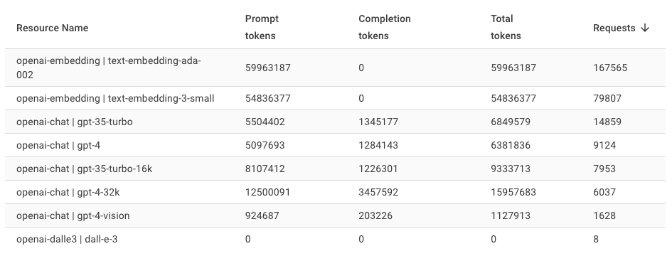

# Reporting

The AI Proxy Admin portal provides a reporting feature that allows you to view the usage of the AI Proxy service. All events are listed in the reporting page, and you can filter the events by key words from the event title and event owner.

The report page summarizes the events that match the search criteria.

## Detailed metrics for each event

You can view detailed metrics for each event by clicking on the event title. The detailed metrics include the following information:

1. Summary of the event, including the event title, event owner, start date and time, end date and time, and the number of registrations.
1. The **New Active Registrations** chart. This is the number of new attendees that have completed an activity in the event. For example, they entered a prompt in the playground, or called a API.
1. The **Requests** chart. This is the number of requests that have been made to the AI Proxy service for the event.
1. The **Resources** table, which is a breakdown of the resources that have been used in the event. The number of requests and tokens for a model.

### New Active Registrations over time

### AI Proxy Requests over time

### Event resource usage

