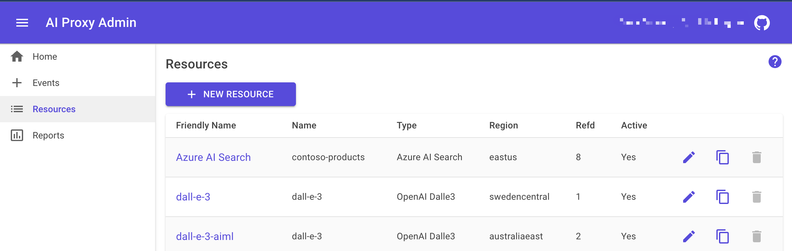
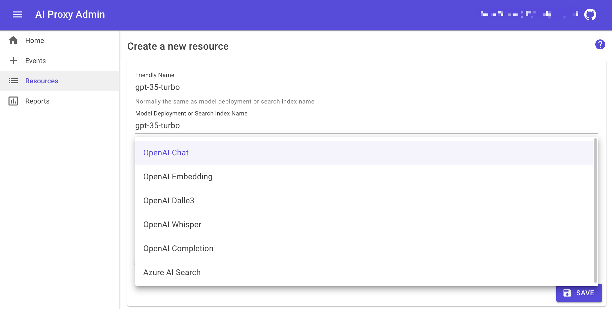

# Configuring resources

To use the Azure OpenAI proxy service, you need to configure the resources. This guide will walk you through the process of configuring the resources.

## Configuring resources

The following assumes you have an AI Proxy deployment for your organization and have access to the AI Proxy Admin portal to configure the resources. If you do not have an AI Proxy deployment, please refer to the [deployment guide](deployment.md).

This is typically a one-off process. Once you have configured the resources, you can use the same resources for multiple events.

1. Create the required Azure OpenAI models and AI Search services in your Azure subscription.
1. Sign into the AI Proxy Admin portal and authenticate using your organization's Entra credentials.
1. Select the `Resources` tab, then add a collection of resources that you will use for your events.

    

1. Add the Azure OpenAI models and AI Search services to the resources collection.

    

### Load balancing resources

For larger events with many attendees (for example 200 concurrent users generating 4 model requests per minute) you can configure multiple resources with the same resource name to balance the load.

For example, you can deploy multiple `gpt-35-turbo` models in different Azure OpenAI resources with the same name. The proxy will round robin across the models of the same deployment name to balance the load. See the [Capacity Planning](./capacity.md) guide for more information.
